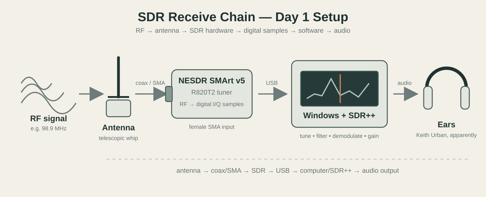

# 001 — First Signal

## Session Details
- **Date:** 2026-09-08
- **Location:** K7K5K6, Ontario
- **Session goal:** Get the NESDR SMArt v5 operational, receive my first signal, and begin learning SDR++.
- **Learning objective:** Understand the basic SDR signal chain and begin developing a feel for frequency, bandwidth, modulation, gain, the spectrum display, and waterfall.

## Hardware and Software
- **SDR:** Nooelec NESDR SMArt v5
- **Tuner:** R820T2
- **Antenna:** Telescopic antenna supplied with SDR kit
- **Computer / host:** Windows desktop (Depot)
- **SDR software:** SDR++ v1.3.0
- **Driver:** WinUSB, installed with Zadig
- **Sample rates tested:** 250 kHz, 2.4 MHz
- **Gain:** Tuner AGC initially; later experimented with manual gain
- **Other equipment:** Headphones, C4

## Building the Receive Chain

## Session Goal

It is Day 1 with an actual SDR and the plan is deliberately simple:

1. Make the SDR work.
2. Receive a known broadcast signal.
3. Figure out what the spectrum and waterfall are actually telling me.
4. Take a quick peek at civilian VHF airband.
5. Resist immediately disappearing into seventeen unrelated rabbit holes.

---

## Setup and Troubleshooting

### Driver Installation

I installed the WinUSB driver for the NESDR using Zadig.

The SDR was identified successfully by Windows and later appeared in SDR++ as:

`Nooelec NESDR SMArt v5`

### SDR++ Startup Failure

SDR++ initially refused to cooperate.

The program displayed its startup splash/module-loading sequence and then immediately terminated. Moving SDR++ out of `Program Files` did not solve the problem, and connecting/disconnecting the SDR did not appear to change the behaviour.

Ran SDR++ from PowerShell with:

`.\sdrpp.exe -c`

This exposed the startup sequence in the console. SDR++ progressed through module initialization and then died shortly after initialization of the radio-related modules.

The eventual cause was:

**Windows had no available audio output device.**

Apparently SDR++ v1.3.0 really wanted somewhere to put the fucking sound.

Plugging my headset into the back of the computer at random allowed SDR++ to launch normally.

### Lesson

When SDR software crashes, don't assume the SDR hardware itself is the problem.

The complete chain matters:

`antenna → SDR → USB/driver → SDR software → demodulator → audio device`

A failure at the far end of that chain can make the whole application fall over.

---

## First RF Reception

With the NESDR connected and selected as the RTL-SDR source in SDR++, I initially tuned to approximately:

- **Frequency:** 100 MHz
- **Mode:** WFM
- **Bandwidth:** 150 kHz
- **Initial sample rate:** 250 kHz

At first I wasn't receiving anything because the RTL-SDR device itself had not actually been selected in the source panel.

After refreshing the device list and selecting the NESDR, the spectrum immediately came alive.

There was now a visible noise floor and activity in the waterfall.

**The radio was officially radioing.**

---

## First Signal

The first intelligible RF signal received with the SDR was a local country FM station.

The song playing was:

**Keith Urban — "Kiss a Girl"**

Of course it was.

Reception was initially very staticky because I was parked around 100 MHz rather than properly tuned to the station's centre frequency.

I increased the SDR sample rate from:

`250 kHz → 2.4 MHz`

This dramatically widened the visible RF spectrum.

A large, broad signal became clearly visible around:

**98.9 MHz**

Since I believed the country station was broadcasting on 98.9 MHz, this was the first moment where the relationship between the audible station and its visible RF signal really clicked.

I clicked directly onto the centre of the ~98.9 MHz signal.

The audio immediately cleared up.

### First major SDR realization

A radio station is not simply an abstract number on a dial. The transmitter produces a signal occupying a measurable amount of spectrum around a centre frequency.

With the SDR I could simultaneously:

- hear the station;
- see its centre frequency;
- see its approximate occupied bandwidth;
- see nearby signals;
- watch the signal persist through time in the waterfall.

---

## Understanding the Display

The SDR++ interface began making considerably more sense during this experiment.

### Spectrum

The upper graph represents received RF energy across the currently sampled frequency range.

Horizontal position corresponds to **frequency**.

Vertical position represents **signal level**.

A strong signal rises above the surrounding noise floor as a visible peak.

### Waterfall

The waterfall is effectively spectrum plus time.

- **Horizontal axis:** frequency
- **Vertical progression:** time
- **Colour/intensity:** relative signal strength

A continuous transmitter can therefore create a persistent trail, while a brief transmission can appear as a short streak.

This became particularly useful once I started looking at airband, where signals are intermittent rather than continuous.

### Sample Rate

Changing the RTL-SDR sample rate from 250 kHz to 2.4 MHz increased the amount of spectrum visible at once.

This did **not** mean that the radio was demodulating all of those stations simultaneously.

The SDR was *observing* a wide chunk of spectrum while the radio demodulator was *listening* to the much narrower selected passband.

That distinction was extremely useful:

**sampled spectrum ≠ demodulated bandwidth**

---

## Gain Experiment

I initially enabled **Tuner AGC**.

The resulting audio was still staticky, but I noticed something interesting: it sounded as though some components of the received audio had been suppressed while others became more prominent.

This initially sounded almost like an EQ change.

However, Tuner AGC is not an audio equalizer.

It changes RF gain before demodulation. Changing the relationship between the desired RF signal and surrounding noise can therefore alter the perceived quality of the resulting audio.

Later, I returned to FM broadcast and experimented with **manual gain**.

I located several additional stations and adjusted gain until they became more intelligible.

This demonstrated an important principle:

**more gain does not automatically mean better reception.**

Gain increases both desired signals and unwanted noise/interference.

What matters is the relationship between them:

**signal-to-noise ratio (SNR).**

The goal is to make the useful signal stand out from the shit around it.

---

## First Airband Hunt

After confirming FM reception, I moved into civilian VHF aviation frequencies just to take a peek.

### Settings

- **Frequency range:** approximately 118–137 MHz
- **Mode:** AM
- **Bandwidth:** approximately 10 kHz
- **Sample rate:** 2.4 MHz
- **Squelch:** Off
- **Gain:** Tuner AGC during initial exploration

This produced a completely different listening experience from broadcast FM.

Instead of a large continuous WFM transmission, the band was mostly noise with occasional narrow features appearing in the spectrum/waterfall.

No intelligible aircraft voice transmission was received during this session.

There were several suspicious-looking signals and some noises that sounded vaguely like helicopter/propeller sounds, but nothing could be positively identified as aviation traffic.

Which is an important lesson in itself:

**A weird noise is not an aircraft just because I really want it to be an aircraft.**

Some persistent narrow vertical lines were also observed in the waterfall.

Because these remained present continuously at essentially fixed frequencies, they were considered more likely to be local interference, electronic spurs, or other persistent RF sources than brief aviation voice transmissions.

This introduced another useful waterfall heuristic:

- **Persistent narrow line:** investigate; potentially interference/spur/continuous carrier.
- **Brief narrow streak:** potentially a short transmission.
- **Broad continuous signal:** more characteristic of something like broadcast FM.
- **Nothing:** congratulations, I have discovered static.

---

## Noise Floor

One immediate question I had during airband monitoring was:

**Why the hell is there so much noise?**

Even when no useful transmission is present, an SDR receives a combination of:

- receiver/electronic noise;
- thermal noise;
- natural RF noise;
- human-made electromagnetic interference;
- noise amplified by receiver gain.

A desktop computer environment is also full of potential RF garbage:

- computer electronics;
- monitors;
- USB devices and cables;
- switching power supplies;
- chargers;
- LED lighting;
- networking equipment.

The background level visible in the spectrum is the **noise floor**.

A useful signal needs to be distinguishable from this noise rather than merely "strong" in isolation.

---

## Experiment Log

| Change or action | Expected result | Actual result |
|---|---|---|
| Installed WinUSB with Zadig | SDR recognized by SDR software | Success |
| Launched SDR++ | SDR++ opens | Immediately fucking died |
| Moved SDR++ outside `Program Files` | Eliminate permissions/path issue | Still died |
| Ran `sdrpp.exe -c` | Reveal startup failure information | Startup sequence became visible |
| Restored Windows audio output | Give SDR++ a valid audio device | SDR++ launched successfully |
| Selected RTL-SDR source | Access NESDR | Source module available |
| Refreshed and selected NESDR device | Begin receiving RF samples | Spectrum/waterfall came alive |
| Tuned around 100 MHz WFM | Find broadcast FM | Heard staticky country music |
| Increased sample rate to 2.4 MHz | Observe wider spectrum | Multiple signals became visible |
| Tuned directly to 98.9 MHz peak | Improve reception | Keith Urban cleared right the fuck up |
| Enabled Tuner AGC | Automatically manage tuner gain | Changed received signal/noise characteristics |
| Experimented with manual gain | Improve weaker FM reception | Several additional stations became audible |
| Switched to AM / airband | Find aviation traffic | Found signals/noise, but no confirmed voice traffic |

---

## Results

### What worked

- NESDR successfully installed and recognized.
- SDR++ successfully configured.
- First RF signal received.
- Broadcast FM successfully demodulated.
- Multiple FM stations visually identified and received.
- Manual gain experimentation improved reception.
- VHF airband successfully explored.
- Spectrum and waterfall went from mysterious blue/red slop to something I could actually begin interpreting.

### What did not work

- SDR++ initially crashed because no audio output device was available.
- Initial FM tuning was poorly centred.
- No confirmed aviation voice traffic was received.

### Main Conclusion

**The SDR works.**

More importantly, I can now connect something I hear through the radio with something I see in the RF spectrum.

Before this session, frequencies were mostly numbers.

By the end of it, I could look at the waterfall, identify a broad signal around 98.9 MHz, tune onto its centre, adjust gain, and hear the corresponding station become intelligible.

---

## Concepts Learned

### New concepts

- Centre frequency
- Sample rate
- Demodulation bandwidth
- WFM vs AM
- Spectrum display
- Waterfall
- Noise floor
- RF gain
- Automatic gain control (AGC)
- Signal-to-noise ratio
- Persistent vs intermittent signals

### Things that became clearer

**Frequency and bandwidth are different things.**

98.9 MHz describes the centre of the FM station, but the actual RF transmission occupies bandwidth around that frequency.

**The SDR can observe more spectrum than I am actively listening to.**

A 2.4 MHz sample rate gives me a wide RF window, while the demodulator selects a much narrower portion of it.

**The waterfall is history.**

It allows me to notice transmissions that occurred even if I wasn't staring at the exact frequency when they happened.

**Gain isn't volume.**

It changes the RF signal entering the demodulation chain rather than simply making the final audio louder. Not entirely clear but I'm getting there.

### Things I still don't understand

- How to choose optimal manual gain systematically.
- How to distinguish local electronic interference from legitimate RF signals.
- How SDR++ determines/display signal level.
- How sample rate affects CPU load, resolution, and receiver performance.
- How squelch should be configured for intermittent aviation traffic.
- What the various AGC modes actually do internally.
- How antenna length/orientation/location will affect reception at different frequencies.

---

## Follow-up

- [ ] Receive and positively identify my first aviation voice transmission.
- [ ] Build a small local aviation-frequency monitoring list.
- [ ] Experiment systematically with manual gain vs Tuner AGC.
- [ ] Test antenna position near a window / away from the desktop.
- [ ] Learn how to recognize common forms of local RF interference.
- [ ] Experiment with squelch on airband.
- [ ] Save useful waterfall screenshots with frequency/settings noted.
- [ ] Eventually investigate 1090 MHz ADS-B aircraft reception and decoding.
- [ ] Start figuring out how to drag JavaScript/web programming into this delightful mess.

---

## References and Files

### Screenshots

1. Initial non-receiving / troubleshooting state
2. First active RF spectrum
3. Wide 2.4 MHz FM broadcast view
4. Initial VHF airband exploration
5. Persistent narrow signals observed in airband
6. Final return to 98.9 MHz while experimenting with gain and nearby FM stations

### Capture files

None yet.

---

## Freeform Notes

Day 1 with an SDR was more successful than I expected, considering SDR++ spent the opening act repeatedly killing itself because Windows didn't have a speaker available.

Conclusion: Keith Urban nostalgia, no aircraft yet, radio is cool shit.