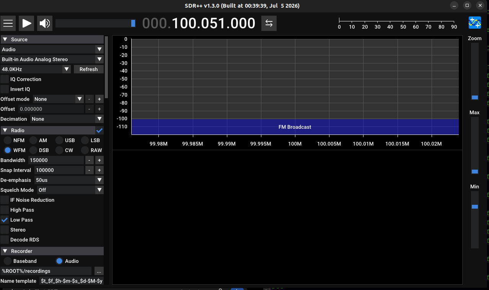
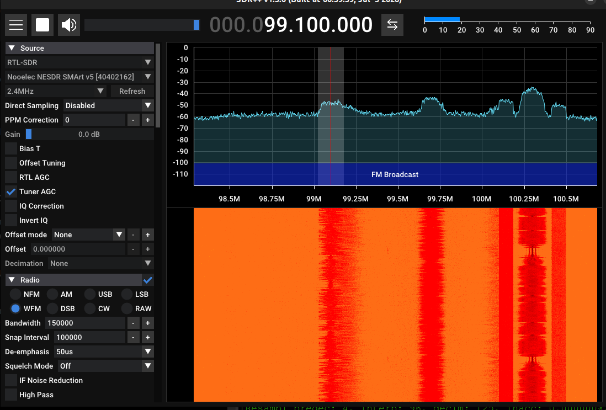
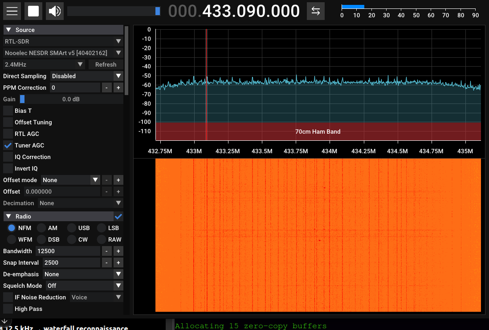
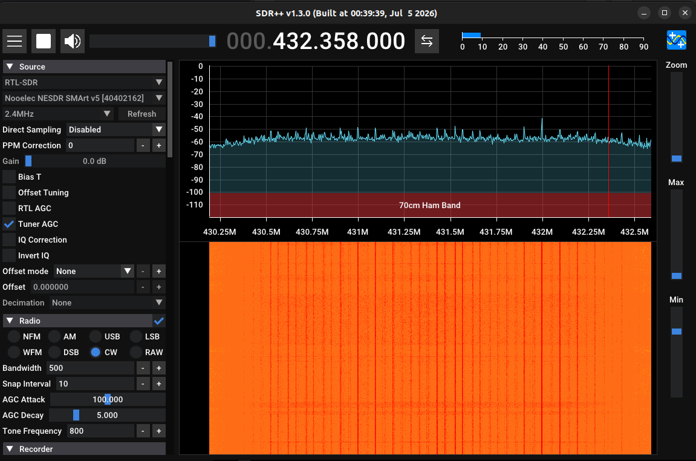
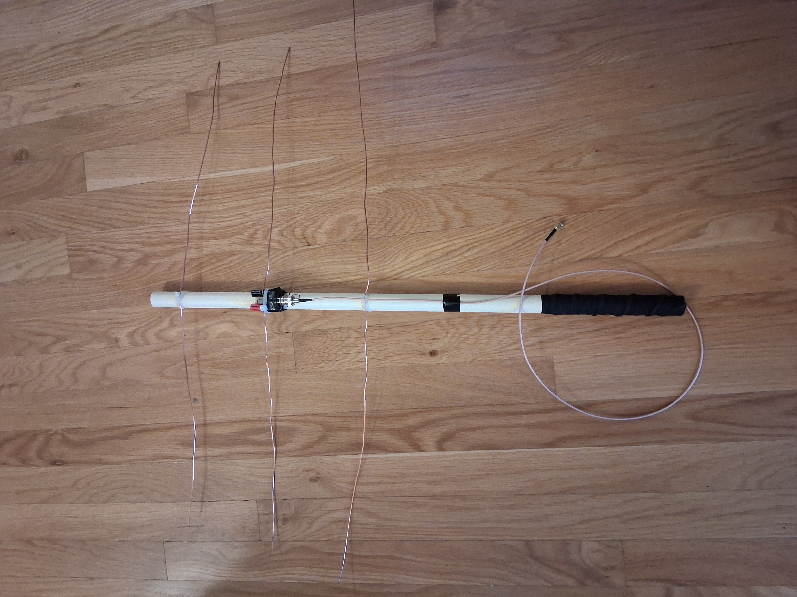
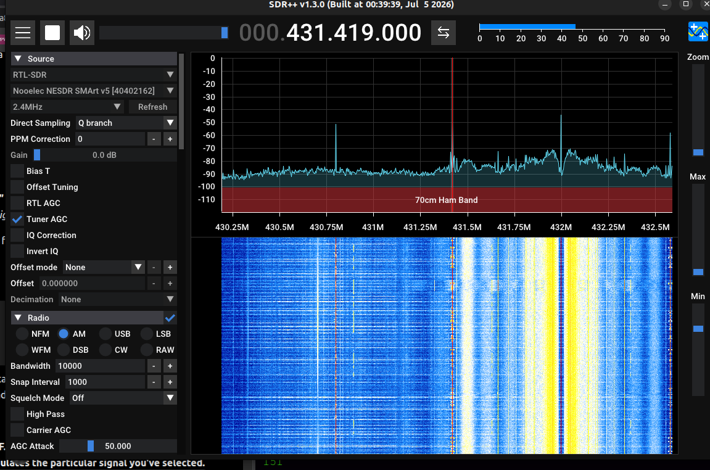
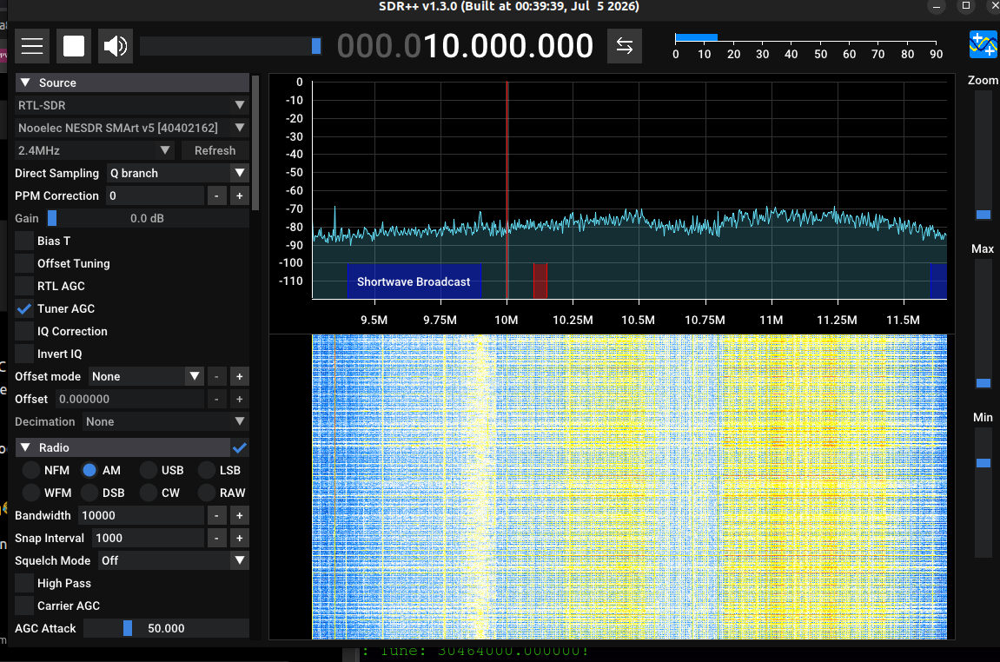

# 002 --- Linux Field Radio

## Mission

Take the NESDR away from the desktop, make it work on the ThinkPad, and
see what the RF environment looks like from Ottawa.

------------------------------------------------------------------------

## Field Setup

**Location:** West Ottawa, Ontario\
**Host:** ThinkPad T440\
**OS:** Ubuntu 22.04.5 LTS (Jammy Jellyfish), amd64\
**RAM:** \~8 GB installed / 7.6 GiB usable\
**SDR:** Nooelec NESDR SMArt v5\
**USB interface:** RTL2832U\
**Tuner:** Rafael Micro R820T2\
**Audio:** Jabra Speak2 40 USB speaker/mic

Antennas available for today's nonsense:

-   Telescopic NooElec kit antenna
-   Small NooElec kit antenna with loading coil
-   Homemade copper-wire antenna with PVC boom ("Dragon Lord")

------------------------------------------------------------------------

# Part 1 --- Does Linux Even See the SDR?

Before installing SDR++, I plugged in the NESDR and checked whether
Ubuntu could see it at all.

``` bash
lsusb
```

There it was:

``` text
0bda:2838
```

Good.


Next:

``` bash
sudo apt update
sudo apt install rtl-sdr
```

Installed just fine and without drama.

I had expected that I might need to manually install udev rules, but
Ubuntu's `rtl-sdr` package had already provided:

``` text
/usr/lib/udev/rules.d/60-librtlsdr0.rules
```

Inside it was the relevant rule:

``` text
SUBSYSTEMS=="usb", ATTRS{idVendor}=="0bda", ATTRS{idProduct}=="2838", ENV{ID_SOFTWARE_RADIO}="1", MODE="0660", GROUP="plugdev"
```

I was already in the `plugdev` group.

So rather than enthusiastically copying random rules files into
`/etc/udev/rules.d/` because the internet told me to, I left the working
configuration alone.

Reloaded the rules:

``` bash
sudo udevadm control --reload-rules
sudo udevadm trigger
```

Unplugged the NESDR.

Plugged it back in.

Go-Time.

------------------------------------------------------------------------

# Part 2 --- `rtl_test`

I ran:

``` bash
rtl_test
```

And immediately got:

``` text
Found 1 device(s):
  0: Nooelec, NESDR SMArt v5, SN: 40402162

Using device 0: Generic RTL2832U OEM
Detached kernel driver
Found Rafael Micro R820T tuner
Sampling at 2048000 S/s.
Reading samples in async mode...
Allocating 15 zero-copy buffers
```

There was also:

``` text
[R82XX] PLL not locked!
lost at least 240 bytes
Samples per million lost (minimum): 7
```

But the important part was that it found the dongle, found the tuner,
opened it, and started streaming I/Q samples.

I let it run briefly and killed it with `Ctrl+C`.

The kernel driver reattached afterward.

**Excellent. The tiny radio lives.**

This also gave me a useful troubleshooting boundary:

``` text
NESDR
↓
USB
↓
Linux
↓
udev permissions
↓
librtlsdr
↓
I/Q samples
```

All confirmed working.

If SDR++ shit itself after this, I would at least know where *not* to
start looking.

------------------------------------------------------------------------

# Part 3 --- Installing SDR++ Without Angering Ubuntu

The machine identified itself as:

``` text
Ubuntu 22.04.5 LTS
Codename: jammy
Architecture: amd64
```

The SDR++ nightly releases included exactly what I wanted:

``` text
sdrpp_ubuntu_jammy_amd64.deb
```

Downloaded it and installed it with:

``` bash
sudo apt install ~/Downloads/sdrpp_ubuntu_jammy_amd64.deb
```

Installation completed successfully.

SDR++ reported:

``` text
SDR++ v1.3.0
Built at 00:39:39, Jul 5 2026
```

For the first launch, I deliberately left the NESDR unplugged.

This was partly because I wanted to test the application independently,
and partly because Session 001 taught me the ridiculous lesson that
SDR++ on Windows could crash because **the computer had no audio output
device**.

This ThinkPad had a Jabra Speak2 40 connected and Ubuntu was already
happily sending YouTube through it.



SDR++ opened as expected, then I connected the NESDR.

SDR++ saw:

``` text
Nooelec NESDR SMArt v5
```

------------------------------------------------------------------------

# Part 4 --- Find Something Obvious First

Before wandering off into weird frequencies, I wanted one boring,
undeniable RF signal.

The first target was broadcast FM.

Session 001's first station had been 98.9 MHz in Kingston, accompanied
by the historic first received song:

> Keith Urban --- *Kiss a Girl*

Ottawa did not care about preserving continuity for my field
journal.

98.9 wasn't giving me much here.

But around:

``` text
99.1 MHz
```

there it was.

Settings:

``` text
Mode: WFM
Bandwidth: ~150 kHz
Sample rate: 2.4 MHz
Direct Sampling: Disabled
PPM: 0
Tuner AGC: Enabled
```

Big fat commercial FM signal. Nice!

There were multiple other FM stations visible in the sampled window.

So the whole chain worked:

``` text
RF
↓
telescopic antenna
↓
NESDR
↓
USB
↓
librtlsdr
↓
Ubuntu
↓
SDR++
↓
WFM
↓
Jabra
↓
ears
```

**First successful RF reception on Linux.**



At this point the primary mission for Session 002 was technically
complete but I didn't see the point in stopping.

------------------------------------------------------------------------

# Part 5 --- 433 MHz: What Are All These Fucking Lines?

It was time to leave the extremely civilized world of commercial FM so I swapped to the smaller NooElec kit antenna with the loading coil and
headed up around 433 MHz.

Initial setup:

``` text
Frequency: ~433 MHz
Mode: NFM
Bandwidth: ~12.5 kHz
Sample rate: 2.4 MHz
Direct Sampling: Disabled
Tuner AGC: Enabled
```

The waterfall looked completely different. Instead of giant broad FM stations, I had **tons of extremely thin
persistent vertical lines**.



At first:

> RADIO!

Then:

> ...wait.

The antenna was sitting inside a suburban house surrounded by a laptop,
USB devices, chargers, power supplies, networking gear, lighting,
wiring, and the usual modern electromagnetic hellscape.

So I moved the antenna outside, and a bunch of the lines got weaker.

Oh.

**I was listening to the empty fucking house.**

Not necessarily *all* of them, obviously. But the experiment strongly
suggested that many of those suspiciously perfect persistent lines were
locally generated RFI rather than interesting distant transmitters.

Turns out this was one of the better experiments of the session because
almost nothing else changed.

``` text
antenna indoors
→ lots of strong skinny lines

antenna outside
→ many skinny lines weaken
```

Same receiver.

Same general frequency range.

Different antenna environment.

That is evidence.

Somewhere in here I also heard something that sounded uncannily like a
phone ringing. Twice.

Could have been a digital/control signal being tortured through an NFM
demodulator. It remains a mystery.

------------------------------------------------------------------------

# Part 6 --- Beacon Hunt

Now that UHF was alive, I wanted a known signal.

Target:

``` text
VE3WCC - West Carleton Amateur Radio Club
432.358 MHz
CW propagation beacon
```

First attempt: little kit antenna.

Nothing obvious.

Second attempt: telescopic whip, extended to roughly 6-7in.

Settings eventually settled around:

``` text
Frequency: 432.358 MHz
Mode: CW
Bandwidth: 500 Hz
Sample rate: 2.4 MHz
Direct Sampling: Disabled
Tuner AGC: Enabled
```

Still nothing I could confidently identify as the beacon.



So:

> **Beacon not detected under the conditions of this session.**

Not:

> beacon was off


A low-power narrowband beacon is a very different problem from receiving
a commercial FM transmitter whose entire purpose in life is to scream
music across a city.

No confirmed beacon, but I still learned something.

------------------------------------------------------------------------

# Part 7 --- LET'S TRY HF

I had another antenna available: a homemade one, known to have previously worked with an electronic spectrum analyzer.



This thing looked sufficiently degenerate and radio-ish that I thought:

> Ah yes. An HF antenna?

This was a reasonable hypothesis.

It was also wrong, but I didn't know that yet.

For HF, I changed:

``` text
Direct Sampling: Q branch
```



This was an important conceptual distinction.

Q-branch direct sampling changes the **receiver path**.

AM/USB/LSB/CW changes the **demodulation**.

So:

``` text
Q branch
≠
USB mode
```

They answer completely different questions.

The first deliberate HF stop was:

``` text
10.000 MHz
```

AM, roughly 10 kHz bandwidth.

This was the first time I'd intentionally looked at the HF spectrum with
the SDR.



No confirmed station.

Then I tried Canada's CHU time station at:

``` text
7.850 MHz
```

Still nothing I could identify as CHU.

And then, wandering around nearby:

``` text
~7.490 MHz
```

**music.**

Faint, but unmistakably music.

I considered a possible shortwave broadcaster, but I never heard a
station ID, so the field-note version remains:

> **Faint AM broadcast-like audio observed near 7.490 MHz, station
> unidentified.**

------------------------------------------------------------------------

# Part 8 --- Perhaps I Should Get the Antenna Off the Fucking Floor

There was one small issue with the homemade antenna: its coax was short and it had no mast. So the antenna was basically lying on the patio outside the living room.

I had to lift it manually, which meant that I had to move away from my computer and couldn't see or hear the waterfall very well. But a few frequencies did clear up.

Conclusion: Antenna placement matters, and this is currently a 2-person job.

------------------------------------------------------------------------

# Part 9 --- The "HF Antenna"

I found the construction instructions for the homemade antenna.

Title:

> **Building the Yagi Antenna**

Oh no.

The antenna consisted of:

``` text
Reflector:       35 cm
Driven element:  16.5 cm + 16.5 cm
Director:        31 cm

Reflector → driven: 15 cm
Driven → director:  15 cm
```

PVC boom approximately 50--60 cm long.

Three elements: Longest in back, split driven element in the middle, shortest in front.

This was not an HF antenna, but a **three-element UHF Yagi**.
Specifically, its dimensions are consistent with the general
neighbourhood of the **70 cm band**, and had originally been used for **radio direction-finding with
walkie-talkies**, so I had spent part of the evening asking a direction-finding antenna built
for handheld radios to please receive shortwave. (In my defence it did actually hear some music around 7.490 MHz.).


------------------------------------------------------------------------

# What the Yagi Is Actually Good For

The janky Yagi is considerably more useful than I thought though; it does give me a directional UHF antenna.

That means future experiments can include:

-   Forward gain
-   Front-to-back response
-   Signal nulls
-   Polarization
-   Direction finding
-   Comparing an omnidirectional antenna against a directional one
-   Rotating the antenna while watching signal strength in SDR++

The basic geometry also gave me a very tangible lesson:

``` text
frequency
↔
wavelength
↔
antenna dimensions
```

A \~33 cm driven element should have been a giant clue that this thing
was nowhere near a conventional HF antenna.

------------------------------------------------------------------------

# Meanwhile, Apparently There Were Military Aircraft Overhead

In a particularly offensive post-session development, I learned that
**U.S. military aircraft suspected to be AF1 had reportedly been flying over the Ottawa area with two additional escort aircraft
while I had been trying --- and failing --- to hear airplanes.**

The airplanes were there and this is now personal.

My brief previous aircraft hunting had concentrated mostly on civil VHF airband, and that was not necessarily wrong: military aircraft transiting normal
controlled airspace can absolutely use ordinary civil ATC frequencies sometimes.


For my next aircraft hunt though, the map will be:

---
| Range | Band | Why I care |
|---|---|---|
| **118–137 MHz** | VHF | Civil aviation / ATC; military aircraft can also appear here |
| **225–400 MHz** | UHF | Major military aviation hunting ground |
| **243.000 MHz** | UHF | Military & emergency; worth watching, not expected to be routine chatter |
| **3–30 MHz** | HF | Long-distance/remote/oceanic aviation; not my first choice for an aircraft physically overhead |
---


And another important lesson:

``` text
AIRCRAFT VOICE
VHF 118–137 MHz → AM
UHF 225–400 MHz → AM
```

Being in UHF does **not** mean I should automatically select NFM; frequency band and modulation are separate things.

------------------------------------------------------------------------

# Why My Aircraft Luck May Have Sucked

There are now several perfectly mundane explanations for why the
aircraft have remained elusive.

### 1. I wasn't searching enough spectrum.

118--137 MHz was useful, but for military aircraft I also want to deliberately investigate
225--400 MHz.

### 2. Aircraft don't transmit continuously.

An airplane can be right there while the radio remains gloriously
silent, so scanning at the wrong thirty seconds can mean hearing nothing.

### 3. Antenna placement has been mediocre.

A low antenna inside a tightly packed subdivision is surrounded by
houses, wiring, electronics, fences, and local RFI. Aircraft altitude helps enormously with VHF/UHF line of sight, but there
is no reason to make the receiving end worse than necessary.

### 4. The Yagi is directional.

This is excellent when I know where a transmitter is, but is less excellent for "there is an aircraft *somewhere* in the sky, find the bastard".


For initial aircraft discovery, I think I'd rather have an elevated, reasonably
omnidirectional VHF/UHF antenna, then the Yagi can come out once there's an appropriate signal to
investigate.


------------------------------------------------------------------------

# Next Aircraft Hunt

My next deliberate search for aviation signals should therefore look more like:

``` text
elevated omnidirectional VHF/UHF antenna
↓
NESDR SMArt v5
↓
SDR++
↓
AM
↓
118–137 MHz
+
225–400 MHz
```

Find the signal first, then, where the frequency is appropriate for the Yagi:

``` text
swap antenna
↓
rotate Yagi
↓
watch signal strength
↓
find maximum
↓
find null
↓
become increasingly suspicious-looking to neighbours
```

------------------------------------------------------------------------

# Experiment Log

| Experiment | What I changed | What happened |
|---|---|---|
| **Linux USB test** | Connected NESDR and ran `lsusb` | Device detected as `0bda:2838` |
| **RTL-SDR test** | Ran `rtl_test` | R820T tuner identified; I/Q stream successful |
| **SDR++ install** | Installed Jammy amd64 nightly | Successful |
| **First Linux RF** | Telescopic antenna, 99.1 MHz WFM | Strong FM reception |
| **UHF reconnaissance** | Small loaded antenna, ~433 MHz NFM | Many narrow persistent traces |
| **RFI test** | Moved UHF antenna from inside to outside | Many traces weakened |
| **Weird audio** | Continued ~433 MHz exploration | Heard phone-like ringing twice; unidentified |
| **Beacon hunt** | 432.358 MHz CW | No confirmed beacon |
| **HF test** | Q-branch direct sampling | HF spectrum observable |
| **CHU hunt** | 7.850 MHz AM | No confirmed CHU |
| **Shortwave wandering** | ~7.490 MHz AM | Faint music received |
| **Antenna placement** | Lifted homemade antenna off floor | Some signals became clearer |
| **Antenna investigation** | Read build instructions | Surprise: 3-element UHF DF Yagi |
---

# Things That Actually Clicked Today

## Device detection is not the same as radio reception

There are layers:

``` text
USB sees device
↓
permissions allow access
↓
librtlsdr opens device
↓
samples stream
↓
SDR++ receives samples
↓
demodulator extracts signal
↓
audio output works
```

Testing the layers independently makes troubleshooting much less stupid.

## Sample rate is not demodulator bandwidth

A 2.4 MHz sample rate means I'm looking at roughly a 2.4 MHz-wide chunk
of RF.

A 12.5 kHz NFM or 150 kHz WFM bandwidth means I'm demodulating only a
much smaller slice inside that chunk.

## Gain is not volume

RF gain changes the incoming signal/noise before demodulation, volume changes how loud the resulting audio is.


## Waterfalls contain lies

Or, more accurately:

**I can lie to myself about what the waterfall means.**

A beautiful skinny line is not automatically a mysterious transmitter.

Sometimes it's my laptop.

Move things.

Turn things off.

Change one variable.

See what survives.

## Antenna placement matters immediately

This stopped being a theoretical statement today.

Moving an antenna outside visibly changed the spectrum; lifting another antenna off the patio changed reception.

Environment is part of the receiver.

## Antennas are frequency-dependent objects, not magic copper

The Yagi subplot made this impossible to forget.


------------------------------------------------------------------------

# Screenshots / Images

Planned repo structure:

``` text
images/
└── 002-linux-field-radio/
    ├── 01-rtl-test-success.png
    ├── 02-sdrpp-first-launch.png
    ├── 03-first-linux-rf-reception.png
    ├── 04-70cm-waterfall-reconnaissance.png
    ├── 05-432358-beacon-attempt.png
    ├── 06-first-hf-spectrum-10mhz.png
    ├── 07-chu-7850-attempt.png
    └── 08-homemade-yagi.jpg
```

**To Do**
- ~~Above screenshots will be added later.~~
- ~~Session 001 also still needs its screenshots rescued from the desktop and added to the repo.~~


------------------------------------------------------------------------

# Follow-Up

-   [x] Add screenshots from Session 002
-   [x] Go back to the desktop and add the Session 001 screenshots
-   [ ] Find a known UHF signal and use the Yagi to observe
    directionality
-   [ ] Rotate the Yagi through 360° and compare maximums, minimums, and
    nulls
-   [ ] Build an actual HF wire antenna instead of bullying a UHF Yagi
-   [ ] Get enough feedline to place antennas farther from the computer
    and house electronics
-   [ ] Try CHU again with an antenna that has heard of HF
-   [ ] Try ADS-B around 1090 MHz
-   [ ] Compare Kingston RF with Ottawa RF
-   [ ] Experiment with manual tuner gain instead of relying entirely on
    AGC
-   [ ] Start identifying repeatable local RFI sources
-   [ ] Do a dedicated aircraft hunt across 118--137 MHz and 225--400
    MHz in AM
-   [ ] Get the aircraft antenna elevated and somewhere reasonably open
-   [ ] Keep 243.000 MHz military guard in the aviation watch list
-   [ ] Find the sky bastards and maybe some boats

------------------------------------------------------------------------

# End State

**ThinkPad:** field radio operational\
**SDR++:** working\
**NESDR:** working\
**FM:** acquired\
**UHF:** full of suspicious shit\
**Local RFI:** exposed\
**Beacon:** elusive\
**CHU:** elusive\
**HF:** technically alive, but needs a real antenna\
**American Military Aircraft:** apparently literally overhead.

Session 002 accomplished considerably more than intended: yes the field setup works, and also the list of things I don't understand has become longer but much more specific, which is usually a good sign.

Radio remains cool as shit.
